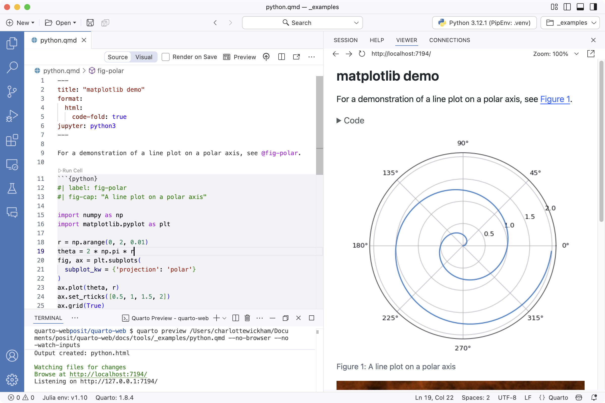

```{r}
#| label: setup
#| include: false
library(dplyr)
library(ggplot2)
library(gt)
data(penguins)
penguins <- penguins |> filter(!is.na(bill_len), !is.na(bill_dep))
# typst-render: register the passthrough knitr engine so {typst} blocks reach the filter
source(file.path(Sys.getenv("QUARTO_PROJECT_DIR"),
                 "_extensions/mcanouil/typst-render/_resources/typst_define.R"))
```

## Learning Outcomes

After this session you will be able to:

- author a Quarto document natively (`.qmd`), with figures, tables, cross-references, and math.
- lay out a document with the article grid and margin content.
- make it **accessible** with alt text, color-blind-safe colors, and a built-in contrast check.
- cite your sources from a `.bib` file in the style a journal asks for.
- turn it into a **branded Typst PDF** (no LaTeX required).

By the end, you will have a **polished PDF report**.

::: notes
- **Say:** "You know R Markdown or Quarto. Today we turn one `.qmd` into a branded PDF with
  citations."
:::

## How today works

Two rounds, each the same shape (**watch → follow along → your turn**):

- Some slides I talk through. A **Follow along** callout opens each hands-on section and an
  **Eyes up** callout closes it.
- Each round ends with a **hands-on Challenge** in the lab (solutions are folded in for self-checking).
- A **break** sits between the two rounds.

Slides and lab live at <https://cderv.github.io/raukr-2026-quarto/>. Open them on your own screen and
move at your own pace.

::: notes
- **Say:** "Two rounds: watch, follow along, then your turn."
- **Do:** pause on the URL. It is the catch-up path.
- **Catch-up:** no exercises folder? Use the Setup page and help them run `use_course()`.
:::

## Setup checkpoint {#setup-check}

::: {.callout-note title="Follow along"}
From the top folder of your downloaded exercises:

``` r
source("00-check-setup.R", local = new.env())
```

Every check reads `[ok]`, and the last line is `>> All good. You are ready for Day 1.`
:::

No exercises folder yet? Get it first, then run the check:

``` r
usethis::use_course("cderv/raukr-2026-quarto-exercises")
```

Any `[FAIL]` line: raise your hand. The fix is on the [Setup page](../../setup.qmd).

::: notes
- **Do:** ~10 min. Ask for hands: who has `[ok]` for every check?
- **Watch for:** `[FAIL] quarto not found`, and missing `knitr`/`rmarkdown` (the two that stop a render).
- **Do:** send failures to a helper and start Part 1 on time. They catch up from the Setup page.
- **Say:** the last check renders the Typst sample, which downloads the workshop fonts. It takes a moment.
:::

# Part 1: Basics {.center}

Author a document and render it to HTML.

## What you can now build {#what-quarto-is}

You know the literate-programming idea. In 2026, one `.qmd` is your source for:

::: {.incremental}
- a **report** (HTML, PDF, Word) with figures, tables, cross-references, and citations.
- a **presentation** (these slides are a `.qmd`).
- a **website or book** (Day 2) with many pages and one configuration file.
- a **branded PDF via Typst** *(a modern PDF engine bundled in Quarto, no LaTeX)*: an article or a long report.
:::

. . .

One tool, many outputs, multiple languages: **all from one plain-text `.qmd` you write directly.**

::: notes
- **Focus:** what they can build now, not a comparison with R Markdown.
:::

## How it all works {#how-it-works}

`quarto render report.qmd` runs your code, then hands Markdown to Pandoc:

```{typst}
#| echo: false
//| align: center
//| alt: "Flowchart: a .qmd goes to either the knitr engine or the Jupyter engine, an .ipynb goes to the Jupyter engine, and a .md goes to the Markdown engine. All three engines feed Pandoc, which renders HTML, PDF, and Word or PowerPoint outputs."
#import "@preview/fletcher:0.5.8" as fletcher: diagram, node, edge

#let teal = rgb("#4C979F")
#let fill = rgb("#D1E5E6")
#let ink = rgb("#1c2833")
#set text(font: ("Albert Sans", "DejaVu Sans"), size: 16pt, fill: ink)

#diagram(
  spacing: (16mm, 8mm),
  node-stroke: teal + 0.8pt,
  node-fill: fill,
  node-inset: 8pt,
  node-corner-radius: 4pt,
  edge-stroke: teal + 0.9pt,

  // inputs
  node((0, 0), [`.qmd` \ text + code], name: <qmd>),
  node((0, 1), [`.ipynb` \ Jupyter], name: <ipynb>),
  node((0, 2), [`.md` \ text only], name: <md>),
  // engines
  node((1, 0), [knitr engine \ R · Python · Julia], name: <knitr>, corner-radius: 20pt),
  node((1, 1), [Jupyter engine], name: <jup>, corner-radius: 20pt),
  node((1, 2), [Markdown engine], name: <mde>, corner-radius: 20pt),
  // pandoc
  node((2, 1), text(fill: white)[*Pandoc*], name: <pandoc>, corner-radius: 20pt, fill: teal),
  // outputs
  node((3, 0), [HTML \ reports · sites · slides], name: <html>),
  node((3, 1), [PDF \ Typst or LaTeX], name: <pdf>),
  node((3, 2), [Word · PowerPoint], name: <office>),

  edge(<qmd>, <knitr>, "->"),
  edge(<qmd>, <jup>, "->"),
  edge(<ipynb>, <jup>, "->"),
  edge(<md>, <mde>, "->"),
  edge(<knitr>, <pandoc>, "->"),
  edge(<jup>, <pandoc>, "->"),
  edge(<mde>, <pandoc>, "->"),
  edge(<pandoc>, <html>, "->"),
  edge(<pandoc>, <pdf>, "->"),
  edge(<pandoc>, <office>, "->"),
)
```

::: notes
- **Say:** "R cells still run through knitr. Existing `.Rmd` files continue to render."
- **If asked:** Quarto selects one engine per document. R documents default to knitr. Python-only
  documents default to Jupyter, while Python can also run through knitr.
- **Mention:** `knitr::convert_chunk_header()` helps migrate chunk options.
:::

## Anatomy of a `.qmd` {#anatomy}

Three parts: a YAML header, Markdown prose, and executable code cells.

```` {.markdown code-line-numbers="|1-4|6|8-13"}
---
title: "A penguin story"
format: html
---

We measured **`{{r}} nrow(penguins)`** penguins.

```{{r}}
#| label: fig-bill
#| fig-cap: "Bill length versus depth"
ggplot(penguins, aes(bill_len, bill_dep, color = species)) +
  geom_point()
```
````

. . .

Cell options use the `#|` "hash-pipe": one YAML option per line.

## Markdown and content: what changes {#markdown-content}

::: {.callout-note title="Follow along"}
In `day1-intro/`, open **`authoring-starter.qmd`** and save it as **`my-report.qmd`**. It opens with
this cell: everything we write next assumes it. Need a completed Part-1 report? Save
`authoring-checkpoint.qmd` (the finished version of this document) as `my-report.qmd` instead.
:::

```` {.markdown}
```{{r}}
#| label: setup
#| message: false
library(dplyr)
library(ggplot2)
library(gt)
library(ggokabeito)   # color-blind-safe (Okabe-Ito) scale
data(penguins)
penguins <- penguins |> filter(!is.na(bill_len), !is.na(bill_dep))
```
````

You already know Markdown. Quarto adds the research-writing pieces: **figures** and **tables** with
captions, **cross-references** (`@fig-bill`, `@tbl-summary`, `@eq-ratio`), **math**, **inline code**
that reports numbers from the data, and **callouts**.

::: notes
- **Say:** "Save the starter as `day1-intro/my-report.qmd`. We will render as we go."
- **Watch for:** the setup cell belongs in the document, not the console.
- **Catch-up:** no `day1-intro/`? Use the Setup page and pair them with a neighbor meanwhile.
- **Focus:** Quarto additions, not a Markdown lesson.
:::

## Figures & cross-references {#figures}

A labeled code cell becomes a numbered, referenceable figure:

```{r}
#| echo: fenced
#| label: fig-bill
#| fig-cap: "Bill length versus depth, by species."
#| fig-alt: >-
#|   Scatter plot of bill depth against bill length
#|   for three penguin species, forming clusters.
#| output-location: column
ggplot(penguins, aes(bill_len, bill_dep,
                     color = species)) +
  geom_point(alpha = 0.8) +
  labs(x = "Bill length (mm)",
       y = "Bill depth (mm)")
```

Refer to it in prose with `@fig-bill` → renders as "@fig-bill", a live link. Labels must start
with `fig-` / `tbl-` / `eq-` to be cross-referenceable.

`#| fig-alt` is the figure's alt text (the description screen readers announce). Add it to every
figure. (`#| output-location: column` is **slide-only**: a revealjs placement, not article layout.)

::: notes
- **Do:** add `label` and `fig-cap`; render and show the number.
- **Say:** "Use `@fig-bill` for a live reference."
- **Watch for:** labels must start with `fig-`, `tbl-`, or `eq-`.
- **Point out:** `output-location: column` is revealjs-only placement.
:::

## Tables {#tables}

`gt` (or `knitr::kable`) turns a data frame into a table. A `#| label: tbl-` makes it referenceable.

```{r}
#| echo: fenced
#| label: tbl-summary
#| tbl-cap: "Mean bill length per species."
penguins |>
  summarise(bill = mean(bill_len), .by = species) |>
  gt() |> fmt_number(bill, decimals = 1)
```

Then refer to it in prose with `@tbl-summary` (the same mechanism as figures).

**Learn more:** [Cross-references](https://quarto.org/docs/authoring/cross-references.html)

::: notes
- **Do:** add `tbl-summary`; render and show the number.
- **Say:** "Same mechanism as figures."
- **Timing:** keep this; cut Math first if needed.
:::

## Math {#math}

Display math with a label is cross-referenceable too:

``` markdown
$$
\text{ratio} = \frac{\text{bill\_len}}{\text{bill\_dep}}
$$ {#eq-ratio}
```

renders as @eq-ratio below:

$$
\text{ratio} = \frac{\text{bill\_len}}{\text{bill\_dep}}
$$ {#eq-ratio}

::: notes
- **Do:** show `{#eq-ratio}` and the numbered equation.
- **Say:** "An `eq-` label makes the equation referenceable."
- **Watch for:** escape underscores in bare math (`bill\_len`).
:::

## Callouts {#callouts}

Callouts are first-class Markdown (no package):

``` markdown
::: {.callout-tip}
Base-R `penguins` (R ≥ 4.5) needs no install.
:::
```

::: {.callout-tip}
Base-R `penguins` (R ≥ 4.5) needs no install.
:::

**Learn more:** [Callouts](https://quarto.org/docs/authoring/callouts.html)

::: notes
- **Do:** render one callout live.
- **Say:** "Five types, same syntax, different meaning and color."
:::

## Inline code {#inline-code}

**Inline code** inserts a computed value into prose. Put it in a sentence:

``` markdown
We measured `{{r}} nrow(penguins)` penguins.
```

. . .

It renders with the live count: "We measured **`{r} nrow(penguins)`** penguins."

. . .

The number updates when the data changes.

**Learn more:** [Inline code](https://quarto.org/docs/computations/inline-code.html)

::: notes
- **Do:** show inline `nrow(penguins)`.
- **Say:** "The number updates with the data."
:::

## Layouts: body, margin, and beyond {#layouts}

::: {.callout-warning title="Eyes up — not a live *Follow along*"}
The live build is done. The next slides cover layout concepts. Your document is ready for the
Challenge.
:::

The **article-layout model** puts content in the **body**, the **margin**, or a zone **wider than
the body** (in the paged formats: HTML, LaTeX, Typst):

- `page-layout: article` / `full`: the overall grid.
- **margin** content: figures, tables, captions, `.aside`, and footnotes.
- **outset / inset**: a figure or table that extends beyond the body (outset) or widens toward
  the page while keeping a margin from the edge (inset).
- **multi-column** `::: {.columns}` and **panels**: tabsets and `layout-ncol`.

::: notes
- **Define:** outset and inset.
- **Point to:** Learn more links for visual examples.
:::

## Put output in the margin {#margin-layout}

A cell's `#| column: margin` drops its output (figure or table, caption and all) into the margin:

```` {.markdown}
```{{r}}
#| label: counts
#| column: margin
penguins |> count(species, name = "n") |> knitr::kable()
```
````

*In the lab you'll use **margin** layout. The rest are in the Quarto docs below.*

**Learn more:** [Article Layout](https://quarto.org/docs/authoring/article-layout.html) ·
[Margin content](https://quarto.org/docs/authoring/article-layout.html#margin-content)

::: notes
- **Say:** "Margin figures still take `@fig-`/`@tbl-` — so layout pairs naturally with cross-refs."
:::

## Make it accessible {#accessibility}

Accessibility is a few habits layered on what you already write:

- **Alt text**: you already add `#| fig-alt:` to every figure. It is what a screen reader announces.
- **Color-blind-safe colors**: the default palette is not safe. Pick one that is:
  [Okabe-Ito](https://jfly.uni-koeln.de/color/) is the common choice in science
  ([`scale_color_okabe_ito()`](https://malcolmbarrett.github.io/ggokabeito/)), viridis suits
  continuous scales. Encode by shape or label too, not color alone.
- **Check contrast**: WCAG wants 4.5:1 on text. Quarto's built-in `axe` runs axe-core on the
  rendered page:

```{.yaml}
format:
  html:
    axe:
      output: document    # or `axe: true` to log to the browser console
      standard: wcag21aa  # the level you are checking against
```

**Learn more:** [HTML Accessibility](https://quarto.org/docs/output-formats/html-accessibility.html)

::: notes
- **Say:** "These habits help on projectors, with color-vision differences, and with screen readers."
- **If time:** show the plot before/after `scale_color_okabe_ito()`.
- **Demo:** `axe: { output: document }` displays the report on the page.
- **Mention:** axe runs in the browser for HTML, revealjs, and dashboards.
:::

## One source → many formats {#document-types}

One key in the header picks the output. The content does not change:

:::: {.columns}
::: {.column width="50%"}
```{.yaml code-line-numbers="false"}
format:                   # render several at once
  html: default
  typst: default
toc: true                 # shared — applies to both
```

```{.yaml code-line-numbers="false"}
format:                   # …or set options per format
  html:
    toc: false
  typst:
    toc: true
```
:::
::: {.column width="50%"}
- **Shared vs. per-format**: top-level keys (`toc`, `number-sections`, …) apply to every format. The `format:` map overrides them per output.
- **Conditional content**: show or hide a block per format:

```{.markdown code-line-numbers="false"}
::: {.content-visible when-format="html"}
Only in HTML.
:::
```

- The *layout* idioms adapt per format: write once, target many.
:::
::::

**Learn more:** [Multiple formats](https://quarto.org/docs/output-formats/html-multi-format.html) ·
[Conditional content](https://quarto.org/docs/authoring/conditional.html)

## Execution: set once, override per cell {#execution}

R Markdown's `knitr::opts_chunk$set()` moves into the header. Set defaults once, override per cell:

:::: {.columns}
::: {.column width="52%"}
Header — defaults for every cell:

``` yaml
execute:
  echo: false
  warning: false
```
:::
::: {.column width="48%"}
A cell — overrides locally with `#|`:

```` {.markdown}
```{{r}}
#| echo: true
summary(penguins$body_mass)
```
````
:::
::::

The header sets the defaults. A cell's `#|` wins.

*`freeze` commits computed results to `_freeze/` so a project re-render (or CI without R) skips
unchanged documents. We'll see it in Day 2.*

**Learn more:** [Execution options](https://quarto.org/docs/computations/execution-options.html) ·
[Cell options](https://quarto.org/docs/reference/cells/cells-knitr.html)

::: notes
- **Do:** set header `echo: false`; override one cell with `#| echo: true`.
- **Say:** "Defaults in YAML, local overrides in the cell. Dashes, and lowercase `false`."
- **Mention only:** freeze returns on Day 2.
:::

## Running & editing {#running}

Run Quarto from the CLI, in whatever editor you like:

``` bash
quarto preview report.qmd   # live-reloading preview
quarto render  report.qmd   # one-off render
```

- **RStudio**, **Positron**, and **VS Code** all work. The **visual editor** (WYSIWYM — *what you
  see is what you mean*) is built into the **RStudio IDE**, and comes to **Positron and VS Code**
  through the **Quarto extension**.
- The same `quarto render` also takes **`-P name:value`**: override a document *parameter* to get
  one report per sample or species from a single source. *(Optional bonus in today's lab.)*

::: notes
- **Do:** run `quarto preview`; edit and show reload. Contrast with `quarto render`.
- **Say:** "Use any editor: RStudio, Positron, or VS Code."
- **Optional:** mention `-P`; the lab bonus uses it.
- **Timing:** brief; cut parameters first.
:::

## Quarto in Positron {#positron}

The same `quarto preview`, from inside the editor: **source on the left, live preview on the right**.
Edit, hit **Preview**, and it live-reloads.

{height="440px" fig-align="center" fig-alt="The Positron IDE with a Quarto document open: a Source/Visual editor toggle and a Preview button above the .qmd source pane on the left, and a live HTML preview of the rendered document on the right."}

::: {.aside}
Screenshot from the [Quarto documentation](https://quarto.org/docs/tools/positron/).
:::

::: notes
- **Say:** "This is the same preview, started from Positron."
- **Point to:** Source / Visual toggle.
- **Do:** show *File > Open Folder...* with `day1-intro/`. Positron does not use `.Rproj` files. The
  folder is the project.
- **Do:** if the console points elsewhere, right-click the day folder in the Explorer and choose
  **Set as Working Directory in Active Console**.
- **Timing:** cut if running late.
:::

## Your turn {#your-turn-1}

::: {.callout-tip title="Your turn"}
Head to the **[Lab](../../labs/quarto/index.qmd#authoring-challenge)** and start at the **Authoring
Challenge**: author a penguins document with a figure, a cross-referenced table, and margin layout,
then render it to HTML.
:::

*You can now author a figure, a cross-referenced table, and margin layout. After the break we cite
it and produce a branded PDF.*

::: notes
- **Say:** "Work on the Authoring Challenge until the break at 15:00. We resume at 15:30.
  Ask us if you get stuck."
- **Watch for:** wrong label prefix; duplicate labels; `#|` options not at the top of a cell.
:::

# Part 2: Citations → Typst {.center}

From report to article: cite it, then typeset it.

::: notes
- **Say:** "You built the HTML document. Now add citations and typeset it as a PDF."
:::

## From report to article {#report-to-article}

You have a clean HTML document. The lab provides a **completed Part-1 report** if you need one. To
make it a **branded article with citations**, add two things:

::: {.incremental}
1. **citations**: a `.bib` file and a citation style.
2. **a typeset PDF** — via **Typst**, bundled in Quarto.
:::

. . .

This is exactly the path from your analysis to a submission, and to your **team project** write-up.

## Citations {#citations}

::: {.callout-note title="Follow along"}
Back in your editor: add citations to your **`my-report.qmd`**. Not finished with Part 1? Save
`authoring-checkpoint.qmd` as `my-report.qmd` first.
:::

Point the header at a `.bib`, then cite with `@key`:

:::: {.columns}
::: {.column width="55%"}
``` yaml
bibliography: references.bib
csl: apa.csl
citeproc: true
```
``` markdown
The data come from Palmer Station [@gorman2014].
```
renders as: … (Gorman et al., 2014).
:::
::: {.column width="45%"}
`references.bib` is in `day1-intro/` (excerpt):

``` {.bibtex}
@article{gorman2014,
  author = {Gorman, K. B. and ...},
  title  = {Ecological Sexual ...},
  year   = {2014}
}
```
:::
::::

Typst places its own list last. With `citeproc: true` the list goes in this div instead:

``` markdown
::: {#refs}
:::
```

**CSL** = *Citation Style Language*. Swap the `csl:` file to restyle every citation.

**Learn more:** [Citations](https://quarto.org/docs/authoring/citations.html)

::: notes
- **Do:** add `bibliography`, `csl`, and `[@gorman2014]`; render.
- **Say:** "The key creates the citation and reference list. Change the CSL to change the style."
- **If asked:** CSL means Citation Style Language.
- **Watch for:** relative `.bib` path; wrong key when `[?]` appears.
- **Watch for:** an empty References section in the PDF means `citeproc: true` is missing.
:::

## A real title block {#authors}

A few header lines add publication metadata (name, affiliation, ORCID, and abstract):

``` yaml
title: "Bill shape distinguishes Antarctic penguins"
author:
  - name: Christophe Dervieux
    affiliation: Posit, PBC
    email: cderv@posit.co
    orcid: 0000-0003-4474-2498
abstract: |
  Using base-R `penguins`, we show bill shape separates species...
```

Renders in HTML, PDF, and Typst. Write it once.

**Learn more:** [Title blocks](https://quarto.org/docs/authoring/title-blocks.html)

::: notes
- **Timing:** cut first. Name author, affiliation, ORCID, and abstract verbally.
:::

## Typst — modern PDF, no LaTeX {#typst}

**Typst** is a modern typesetting system that is **bundled with Quarto**: nothing to install, no
LaTeX toolchain.

``` yaml
format: typst
```

That is the only change. Then re-render:

``` bash
quarto render report.qmd
```

The header already says which format, so nothing else is needed. To get the PDF *without* touching
the header, ask for it on the command line instead: `quarto render report.qmd --to typst`.

::: {.callout-note title="Version check"}
Typst is bundled from Quarto **1.4+**. We require **≥ 1.9** for margin and article layout. Check once with `quarto --version`.
:::

::: notes
- **Say:** "Typst is bundled with Quarto. Nothing else to install."
- **Define:** Typst on first use; LaTeX remains available.
- **Watch for:** serif output plus `unknown font family` means the first font download failed.
:::

## Branding the PDF — `_brand.yml` {#brand}

One `_brand.yml` carries your palette + fonts to the **Typst PDF** you just built, and to the
**plots and tables** inside it:

:::: {.columns}
::: {.column width="55%"}
``` {.yaml filename="_brand.yml"}
color:
  palette:
    teal: "#4C979F"
  primary: teal
typography:
  fonts:
    - family: Albert Sans
      source: google
  base:
    family: Albert Sans
```
:::
::: {.column width="45%"}
- Same file themes HTML and Typst.
- The R side (`theme_brand_ggplot2()` / `theme_brand_gt()` from the **brand.yml** package) themes
  your **plots and tables** from the *same* palette.
- Quarto fetches Google fonts for Typst automatically.
:::
::::

::: notes
- **Do:** add `_brand.yml`; re-render and show color and type changes.
- **Say:** "The same palette can reach plots and tables. Tomorrow it brands a whole project."
- **Watch for:** plots need `theme_brand_*`; first font render needs network.
:::

## Your turn {#your-turn-2}

::: {.callout-tip title="Your turn"}
Return to the **Citations Challenge** in the **[Lab](../../labs/quarto/index.qmd#citations-challenge)**.
Add citations to **`my-report.qmd`** (save `authoring-checkpoint.qmd` as `my-report.qmd` if you did
not finish Part 1), then render it as a **branded Typst PDF**.
:::

::: notes
- **Say:** "Add the bibliography, then render a branded Typst PDF."
- **Watch for:** exact citation key; first font download; PDF lands beside its source; a
  `my-report.qmd` created outside `day1-intro/` (bib and brand not found).
:::

## What you can do now {#wrap-up}

You can now:

- author a `.qmd` natively with figures, tables, cross-references, math, and callouts.
- lay it out with the article grid and margin content.
- make it accessible with alt text, color-blind-safe colors, and a built-in `axe` check.
- cite it with a `.bib` and CSL, and give it a real title block.
- render it as a **branded Typst PDF**.

. . .

**Next (Day 2):** grow one document into a whole **project**, a website your team can publish.

## Thank you! {.center}

Questions?

:::: {.columns}
::: {.column width="28%"}
{fig-alt="QR code for the workshop site, https://cderv.github.io/raukr-2026-quarto/" width="210"}
:::
::: {.column width="72%"}
**Slides + lab:** <https://cderv.github.io/raukr-2026-quarto/>

**Learn more:** [quarto.org/docs/guide](https://quarto.org/docs/guide/) ·
[Typst format](https://quarto.org/docs/output-formats/typst.html) ·
[`_brand.yml`](https://posit-dev.github.io/brand-yml/)
:::
::::

[Christophe Dervieux · [GitHub `@cderv`](https://github.com/cderv){preview-link="false"} · [cderv@posit.co](mailto:cderv@posit.co)]{style="font-size:0.6em"}
